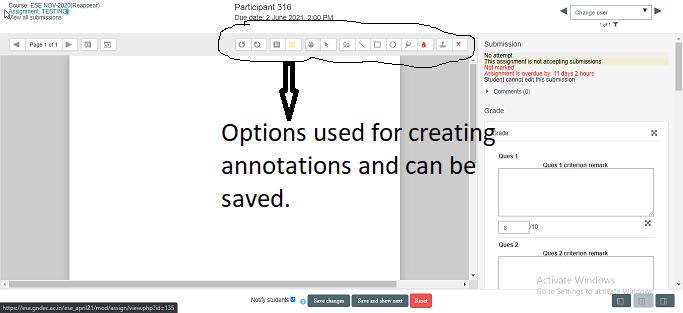

### INSTRUCTIONS TO EVALUATE MOCK TEST ###
1.  Login into *https://ese.gndec.ac.in/ese_april21* using your login credentials of guru.gndec.ac.in.
1. Click on course MAY 2021.
1. Scroll down to the Subject for which evaluation is to be done(For mock test evaluation select *MOCK TEST (11-06-2021)*) and click on it.
1. Following page will appear.  In seperate groups choose 'PaperID' as group.
1. Evaluator can read  Question paper by clicking on filename e.g Mock Test.pdf in above screenshot.
1. If You Click on *View all submissions* , Summary sheet is shown. Initially status of all sheets is *Not Marked*.Evaluator can set two types of status:
    - In Marking        : Evaluation of particular sheet is in process.
    - Marking Completed : Evaluation of particular sheet is completed.
    Evaluators can click on grade to check any particular sheet.
    [This step is not applicable for Mock Test Evaluation]
1.  Evaluator can also click on *Grade*( written with *view all submissions*) 
1.  In Final Paper , there are 9 blocks named Ques1 , Ques 2 .....Ques 9. In criteria remark,Evalutor can write comment about student answer. Below criteria  remark, marks is to be filled and in Case student has not attemped the question ,then in Ques  criterion remark write 'NA' and fill zero marks.

1. For Mock test evaluation , 5 questions are there and guidelines are given to evaluate each question. 
1. Once all questions are checked , set *Marking workflow state*  to *Marking Completed*. [Not Applicable for Mock Test Evaluation]
1. In case sheet is not evaluated completely then status can be set to *In Marking* before clicking on *save changes*.[Not Applicable for Mock Test Evaluation]
2. Evaluators can use annotations tool to write comments on sheets , mark write or wrong, circle sometext etc and save file  with this annotations.
3. Once all sheets are evaluated and status is set to Marked, Inform Your departmental Head Examiner about completion.
4. 

